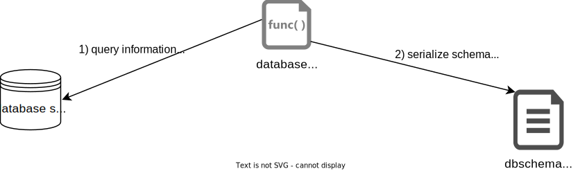
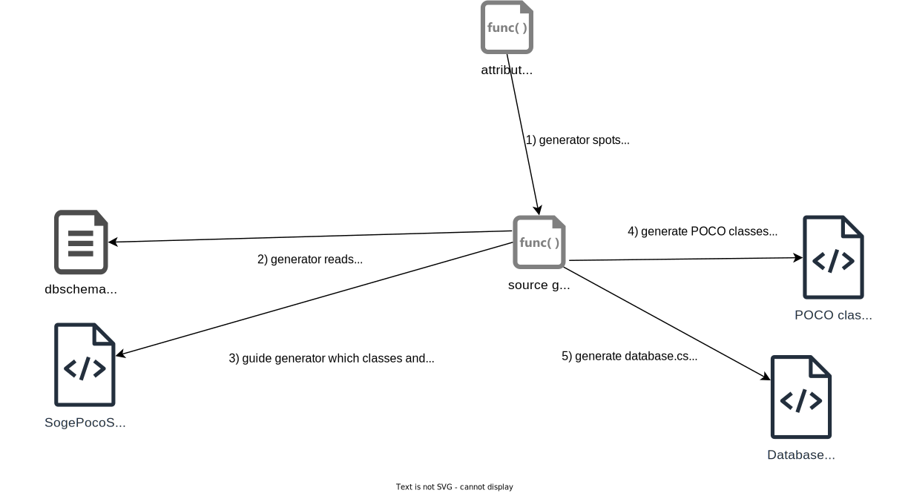
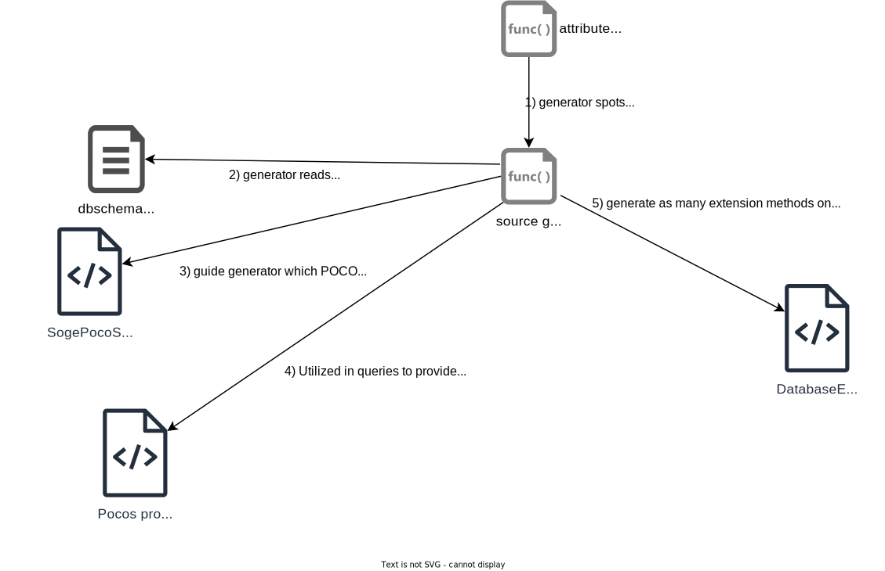

# SogePoco

SogePoco is a dotnet library and source generator to interact with SQL databases in a type safe and easy manner. 
It leverages [incremental source generators](https://github.com/dotnet/roslyn/blob/main/docs/features/incremental-generators.md) to generate [ADO.NET](https://learn.microsoft.com/en-us/dotnet/framework/data/adonet/ado-net-code-examples) commands and readers. Contents of tables is represented in auto-generated classes following plain-old-CLR-object expectations. Currently supported databases: SQL Server, Postgres, Sqlite  
Name: **So**urce **Ge**nerated **P**lain **o**ld **c**lr **o**bjects 

# Quickstart / Demo

[](https://www.youtube.com/embed/Y37LvcjAdko)

If you wish to repeat process yourself, use [same instructions but in text format](docs/quickstart_plan.md).
It works on Windows too as evidenced by tests. In Visual Studio w/wo ReSharper you may need to unload/reload projects to make "errors" go away.

# Example

Assuming that you are dealing with following sqlite database:

```sql
CREATE TABLE foo(
    id INTEGER NOT NULL PRIMARY KEY AUTOINCREMENT,
    nullable_text TEXT,
    not_nullable_text TEXT NOT NULL);

CREATE TABLE child_of_foo(
    id INTEGER NOT NULL PRIMARY KEY AUTOINCREMENT,
    foo_id INTEGER NOT NULL,
    val INTEGER NULL,
    CONSTRAINT FK_ChildOfFoo_fooId FOREIGN KEY (foo_id) REFERENCES foo(id));
```

and that you used default settings in code generator you will end up with following generated Poco classes

```csharp

public class Foo {
    public long Id {get; set;}
    public string NotNullableText {get; set;}
    public string? NullableText {get; set;}

    public Foo(long id, string notNullableText, string? nullableText) {
        this.Id = id;
        this.NotNullableText = notNullableText;
        this.NullableText = nullableText;
    }

    public Foo() : this(default(long), "", default(string?)) {}

    public override string ToString() => @"foo";
} 

public class ChildOfFoo {
    public long Id {get; set;}
    public long FooId {get; set;}
    public long? Val {get; set;}
    
    public class ForeignKeysCollection {
        public SogePoco.Common.JoinInfo<ChildOfFoo,SogePocoIntroduction.Pocos.Foo> Foo_by_FooId                 
            => throw new System.Exception("This code should not be called in runtime, it only servers as DSL during query generation");
    }
    public ForeignKeysCollection ForeignKeys => throw new System.Exception("This code should not be called in runtime, it only servers as DSL during query generation");

    public ChildOfFoo(long id, long fooId, long? val) {
        this.Id = id;
        this.FooId = fooId;
        this.Val = val;
    }

    public ChildOfFoo() : this(default(long), default(long), default(long?)) {}

    public override string ToString() => @"child_of_foo";
} 

```

There will also be a database.cs generated with methods: `Insert(Foo)`,`Insert(ChildOfFoo)`, `Update(Foo)`, `Update(ChildOfFoo)`.

If you request query to be generated in the following way:

```csharp

[GenerateQueries]
public class InvokeGenerator {
    public void GetFoo() => Query.Register((Foo x) => x.NotNullableText == "something");
}

```

SogePoco will generate following code:

```csharp

public static class DatabaseExtensions {    
    public static async System.Collections.Generic.IAsyncEnumerable<SogePocoIntroduction.Pocos.Foo> GetFoo(
            this SogePocoIntroduction.Database self) {

        await using var cmd = self.CreateCommand();
        cmd.Parameters.Add(
            CreateParam(
                cmd,
                @"$0", 
                ((object?)@"something" ?? System.DBNull.Value)));                        
        cmd.CommandText = @"SELECT
""t0"".""id"", ""t0"".""not_nullable_text"", ""t0"".""nullable_text""
FROM ""foo"" as ""t0""
WHERE ""t0"".""not_nullable_text"" = $0;";
        self.LastSqlText = cmd.CommandText;
        self.LastSqlParams = cmd.Parameters.Cast<System.Data.Common.DbParameter>().ToArray();
        await using var rdr = await cmd.ExecuteReaderAsync();

        while (await rdr.ReadAsync()) {
            var iCol = 0;

            var itm0 = new SogePocoIntroduction.Pocos.Foo(
                id:(long)rdr.GetValue(iCol++), 
                notNullableText:(string)rdr.GetValue(iCol++), 
                nullableText:rdr.GetValue(iCol++) switch { System.DBNull => null, var x => (string?)x});
            
            yield return itm0;
        }            
    }
    
    private static System.Data.Common.DbParameter CreateParam(System.Data.Common.DbCommand cmd, string n, object? v) {
        var result = cmd.CreateParameter();
        result.ParameterName = n;
        result.Value = v;
        return result;
    }
}
```

...hence just regular contemporary async ADO.NET command with added benefit of `LastSqlText` and `LastSqlParams` inspired by PetaPoco and others.

# Features

For brevity, please assume that you are dealing with same sqlite database schema as defined in former point.

* request one table query `select * from Foo where nullable_text = 'abc'`

```csharp
use SogePoco.Common;

[GenerateQueries]
class SomeClassToHoldMyRequestsToGenerateQueries {
    public void SomeRequestedQuery() =>	
        Query.Register((Foo f) => f.NullableText == "abc");		
}
```

* to add variable sql parameters e.g. `select * from Foo where nullable_text = $0`

```csharp
use SogePoco.Common;

[GenerateQueries]
class SomeClassToHoldMyRequestsToGenerateQueries {
    public void SomeRequestedQuery(string x) =>	
        Query.Register((Foo f) => f.NullableText == x);		
}
```

* to deal with `null` easily

```csharp
use SogePoco.Common;

[GenerateQueries]
class Irrelevant {    
    //to get equivalent of `select * from Foo where nullable_text is null or nullable_text = $0` use:
    public void GetMatchingFoo(string p) =>	
        Query.Register((Foo f) => f.NullableText == null || f.NullableText == p);
    
    //to get equivalent of `select * from Foo where nullable_text is not null and nullable_text = $0` use:
    public void GetMatchingFoo(string p) =>	
        Query.Register((Foo f) => f.NullableText != null && f.NullableText == p);	
}
```

* to write multi-table queries (`join`ed tables)

```csharp
use SogePoco.Common;

[GenerateQueries]
class Irrelevant {
    /* 
    to get equivalent of
        select * 
        from child_of_foo 
        join foo on foo.id = child_of_foo.foo_id 
        where child_of_foo.val = $0` 
    Notice: you don't need to specify how to join tables. This information is stored as foreign key
    */
    public void GetValueTupleOfChildOfFooAndFoo(int neededVal) =>	
        Query
            .From<ChildOfFoo>()
            .Join(cof => cof.ForeignKeys.Foo_by_FooId)		
            .Where( (cof,f) => cof.Val == neededVal); //no `.Select(...)` hence generated query will return Value tuple of all joined types/pocos. In this case: (ChildOfFoo, Foo)
    
    //you can initiate join from another type (one that doesn't have foreign key) like this:
    public void GetValueTupleOfChildOfFooAndFoo(int prm) =>
        Query
            .From<Foo>()
            .Join((ChildOfFoo cof) => cof.ForeignKeys.Foo_by_FooId, f => f) //second parameter is very important when you have joined at least one table already
            .Where( (cof,f) => f.Val == prm);
    
    public void GetValueTupleOfChildOfFooAndFoo(int v) =>	
        Query
            .From<ChildOfFoo>()
            .Join(cof => cof.ForeignKeys.Foo_by_FooId)		
            .Where( (cof,f) => cof.Val == v)
            .Select((cof,f) => cof); //same as first query but generated query will return `ChildOfFoo` instances instead of ValueTuple: (ChildOfFoo, Foo)

    //you can also use .LeftJoin() with same syntax as .Join() above to get `left join` instead of `inner join` 
}
``` 

* to sort returned instances / to include `order by ... asc` or `order by ... desc` sql clause

```csharp
use SogePoco.Common;

[GenerateQueries]
class Second {
public void GetFoo() =>	
    Query
        .From<Foo>()
        .OrderByAsc(f => f.NotNullableText);
        
        //for reverse order use: 
        //.OrderByDesc(f => f.NotNullableText)
}
```

* to limit amount of returned records / to include `select top N` or `select ... limit N` sql clause

```csharp
use SogePoco.Common;

[GenerateQueries]
class Second {
    public void GetFoo() =>	
        Query
            .From<Foo>()
            .Take(1);            
}
```

* leverage native support for sql parameters being collection  
e.g. you want to pass `new [] {10,50,100}` to `select * from tbl where tbl.col in (10,50,100)` as a single sql parameter in query effectively turning it into `select * from tbl where tbl.col in $0`  

```csharp
use SogePoco.Common;

[GenerateQueries]
class Second {
    public void GetMatchingFoo(string[] mustBeIn) =>
        Query.Register((Foo f) => mustBeIn.Contains(f.NullableText));
}
```

> [!NOTE]
> Support:  
> * In postgres, it works out of the box.  
> * In sqlite it is not supported out of the box (requires [optional extension](https://sqlite.org/carray.html)).   
> * In sql server, it works too <details><summary>with additional setup</summary>
>   - add custom type (e.g. `CREATE TYPE ArrayOfInt AS TABLE(V int NULL)`)   
>   - pass custom mapping to `SqlServerMapper` in your `SogePoco*Config.cs` informing it about custom type name(s)
> More info:  
>   - see [SystemUnderTestFactory](SogePoco.Impl.Tests/PocoGeneration/SystemUnderTestFactory.cs) method `CreateSqlServer(bool withArraysSupport)`.  
>   - see usage of `Syntax.Contains` in [tests](SogePoco.Impl.Tests/QueryGeneration/TestQueryGenerationQueryParameters.cs)
>     </details>

* to do explicit locking in Postgres / to include e.g. `select ... for update`

```csharp
use SogePoco.Common;

[GenerateQueries]
class Second {
    public void GetMatchingFoo() =>	
        PostgresQuery  //notice: different root here
            .From<Foo>()
            .ForUpdate();
            //or .ForShare()
            //or .ForNoKeyUpdate()
            //or: .WithForClause("update nowait or anything custom goes here") 
}
```

**Note** blocking/locking rules in Postgres are much simpler than in Sql Server. It is advised in Sql Server to use different isolation levels instead of playing with query hints (e.g. `with rowlock`). 
See 
[TestLockingUnrelatedTables.cs](SogePoco.Impl.Tests/DatabaseBehavior/TestLockingUnrelatedTables.cs)
 and 
[TestLockingRelatedTables.cs](SogePoco.Impl.Tests/DatabaseBehavior/TestLockingRelatedTables.cs)
to see it yourself. That's why I decided to not implement it (yet?)

There are many more features. At this moment it's best to look at rich collection of included xunit tests to know what else is supported.
* support for automatically incremented version fields  
in postgres using `xmin`; in sql server using `rowversion`
* "rows affected" in `update` and `delete` statement checks  
by default generated Database class checks them. If they are not returning one, you will get exception.
It prevents forgotten check mistakes. If you don't like it, you can set following property to empty action (`() => {}`) to check it yourself or react differently.

```csharp
System.Action<string> OnRowsAffectedExpectedToBeExactlyOne {set;}
```
* computed columns (term of sql server) / generated columns (term of postgres)  
sogepoco understands what computed/generated columns are and is not attempting to `insert`/`update` them while still `select`-ing them 
* columns with defaults  
defaults are extracted and you have ability to decide whether to use Poco class instance value or default value. To use it pass 2nd parameter to generated Database class (=`defaultableColumnShouldInsert`)
see test in [TestLockingUnrelatedTables.cs](SogePoco.Impl.Tests/PocoGeneration/TestsInsert.cs)

## Missing features, shortcomings

Some things that I consider as important and would like to implement them eventually
 
* ability to do custom joins (not following foreign keys but specify columns manually)
* optional support for `Equals(object)` and `GetHashCode()` generation 
  so that two Pocos of the same type having same primary key value are `Equal` 
* better error reporting  
so that errors get source code hint in Rider / Visual Studio. Today, errors show up in build tab and/or log file. 
* little things such as support for `.Take(param_instead_of_literal)`
* support `view`s

# Nuget version / status

[SogePoco.Common](https://www.nuget.org/packages/SogePoco.Common/)


[SogePoco.Impl](https://www.nuget.org/packages/SogePoco.Impl/)


[SogePoco.Template.Postgres](https://www.nuget.org/packages/SogePoco.Template.Postgres/)


[SogePoco.Template.SqlServer](https://www.nuget.org/packages/SogePoco.Template.SqlServer/)


[SogePoco.Template.Sqlite](https://www.nuget.org/packages/SogePoco.Template.Sqlite/)

## Github actions


`dotnet pack` works for all libraries and templates:

 
postgres template generates working POCOs and queries  
(using postgres server instance running in podman container)? 


sqlite template generates working POCOs and queries   
(using in memory sqlite)?


sqlserver template generates working POCOs and queries   
(using sqlserver instance running in podman container)?


all tests (~100) pass when using postgres server  
(instance running in podman container)?


  
all tests (~100) pass when using sqlserver server    
(instance running in podman container)?


all tests (~100) pass when using in memory sqlite (on ubuntu)?


all tests (~100) pass when using in memory sqlite (on windows)?


# High Level Design

<details>
    <summary>Read more about design...</summary>

Whole library relies on knowing: 
* which database engine is in use and 
* what is the database schema

This way, source generator doesn't need connect to db everytime it needs schema. Otherwise things would be *slow*.  
Calling extraction process is only need when db changes e.g. after performing db migrations.  
What schema extractor does can be summarized in following way:



What logically follows after extraction are two invocations of source generator.
First one generates poco classes and database class. Second generates queries build using
those poco classes and registering them as extensions of database class.

First invocation overview:


Second invocation overview:


</details>

# Scope of project and motivation

I wanted to build a spiritual successor of [PetaPoco](https://github.com/CollaboratingPlatypus/PetaPoco), 
[AsyncPoco](https://github.com/tmenier/AsyncPoco) projects but instead of emitting MSIL. I wanted to use 
[incremental source generators](https://github.com/dotnet/roslyn/blob/main/docs/features/incremental-generators.md) which is a recommended technology for metaprogramming.
Apart from that I also wanted to:
* restore benefits of T4 text templates that generated Poco classes from existing database 
[eg](https://github.com/CollaboratingPlatypus/PetaPoco/wiki/T4-Template-Poco-Builder) (=the "database first"). 
T4 is [not working in dotnet core/standard](https://developercommunity.visualstudio.com/t/support-loading-of-net-core-libraries-in-t4-templa/881587). Hence *Poco libraries had a choice to either migrate to dotnet core or drop T4 support. 
* leverage collections as sql parameters
such parameters are available in database engines but *poco libraries tend to not use and instead automagicaly change into as-many-parameters-as-there-are-items-in-collection.
In the past [I forked AsyncPoco and added this feature](https://github.com/d-p-y/AsyncPoco) so I knew it is a valid approach
* add ability for type safe query building
In the past [I've implemented it for AsyncPoco](https://github.com/d-p-y/statically-typed-poco-queries) but it relied on reflection and limited metadata inferred from POCO classes and their attributes. 
I wanted to support `join`s where its `on` clause would be autogenerated from foreign keys to prevent mistakes and be less error prone.


## Goals
* Everything "as async as possible"  
hence usage of features such as [IAsyncEnumerable<T> and IAsyncDisposable](https://learn.microsoft.com/en-us/dotnet/csharp/language-reference/proposals/csharp-8.0/async-streams)
* support tables with both 'generated primary key' and 'manual primary key'  
meaning with or without auto_increment / IDENTITY / serial
* keep it simple and avoid surprises  
while Entity Framework and (N)Hibernate have much more features and cover all edge cases they do it at the cost of significant complexity. 
Hidden state in entity classes and potential pitfalls such as lazy collections are some examples.  
On the other hand, PetaPoco (and other *Poco libraries) feel fragile as they tend to rely on strings and objects limiting type safety.  
[linq2db](https://github.com/linq2db/linq2db) is an interesting middle ground but IMHO uses complicated syntax (e.g for joins).
* What can be checked/computed during compilation, should be performed in comptime (instead of runtime).  
* Avoid providing functionalities that tend to be fragile
e.g. sogepoco has `Insert()` and `Update()` but no `Save()`. It requires guessing game that breaks for tables with
nongenerated primary key.

## Non goals
 * support tables without primary keys
 * support updating primary keys

## License

Apache License 2.0
